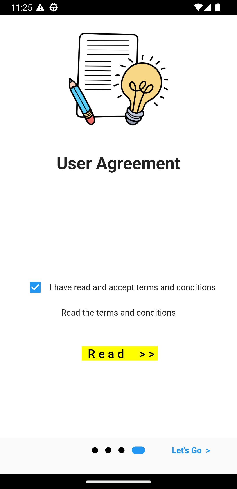
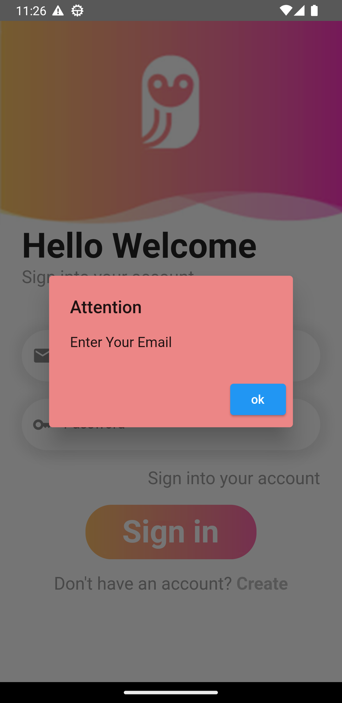
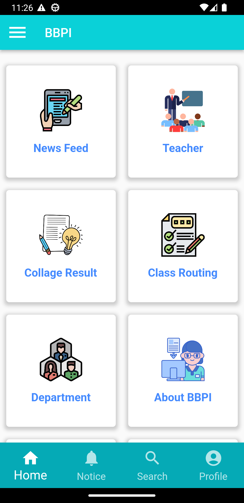
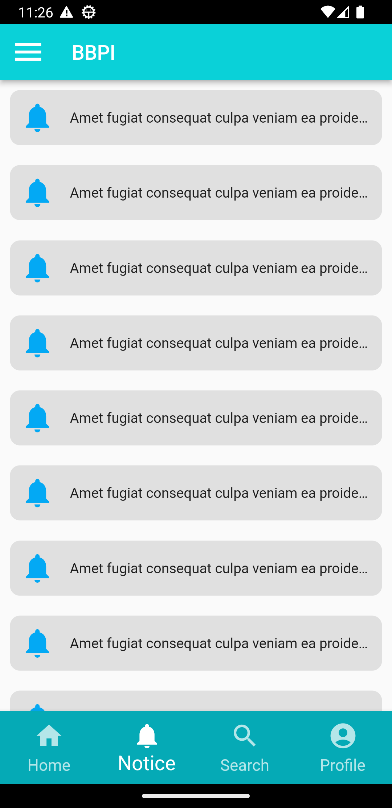
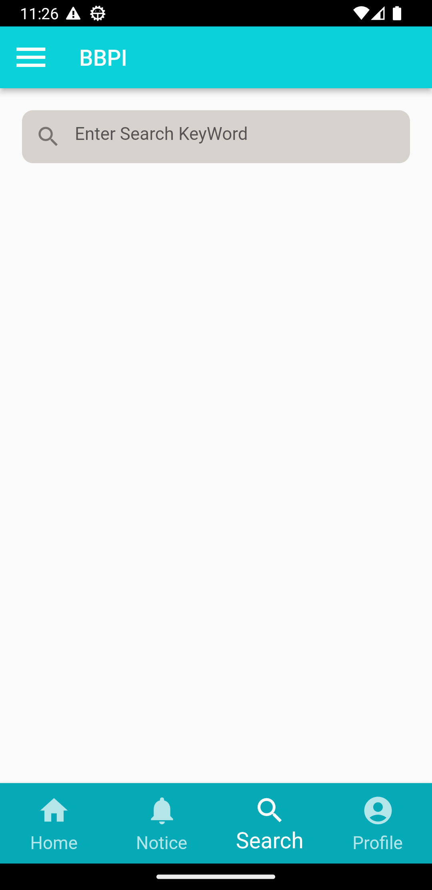
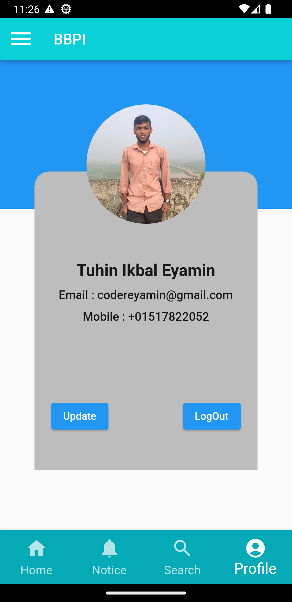
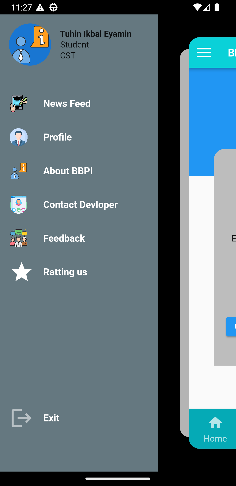

# BBPI : Brahmanbaria Polytechnic Institute

## Features

 - Clean & Modern User Interface
 - Institute information
 - Teacher and student communication system
 - Bord and institute information notice
 - General information

## Screenshots

 

